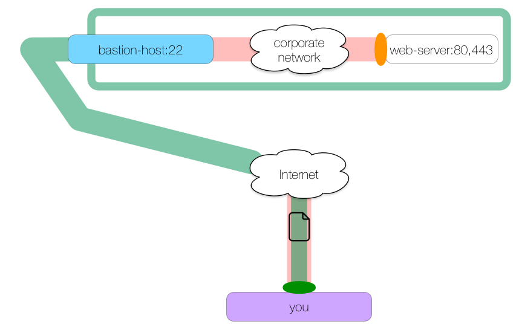

# SSH Tunnel

### Docker SSH Tunnel

Create an SSH Tunnel

Usage:

```sh
docker run -d --rm \
    [-p <outter port>:<inner port> \]
    -v <path/to/id_file>:/key.pem:ro \
    -e "SSH_HOST=<remote host>" \
    [-e "SSH_USER=<login user>" \]
    [-e "SSH_PORT=<ssh port>" \]
    skyjia/ssh-tunnel -<L|R|D> [host1:]<port1>:<host2>:<port2>[ other options]
```

The default `SSH_USER` is `root` and the default `SSH_PORT` is `22`.


### SSH Tunnel Example

> We have an internal company web server we need to access at `web-server` ports 80 and 443. We are outside of the corporate network but the network administrator has configured a bastion host for SSH connections.



Here is the command to create this kind of tunnel:

```sh
ssh -L 8080:web-server:80 -L 8443:web-server:443 bastion-host -N
```

We create one local tunnel whose ingress is on `localhost:8080` and whose egress is at `web-server:80`. We create a second local tunnel whose ingress is at `localhost:8443` and whose egress is at `web-server:443`. Both tunnels pass through `bastion-host`.

We can make HTTP and HTTPS requests to `localhost` ports 8080 and 8443 which will be forwarded to `web-server` ports 80 and 443 respectively:

```sh
curl https://localhost:8443/secure.txt
```


> Reference: https://solitum.net/an-illustrated-guide-to-ssh-tunnels/